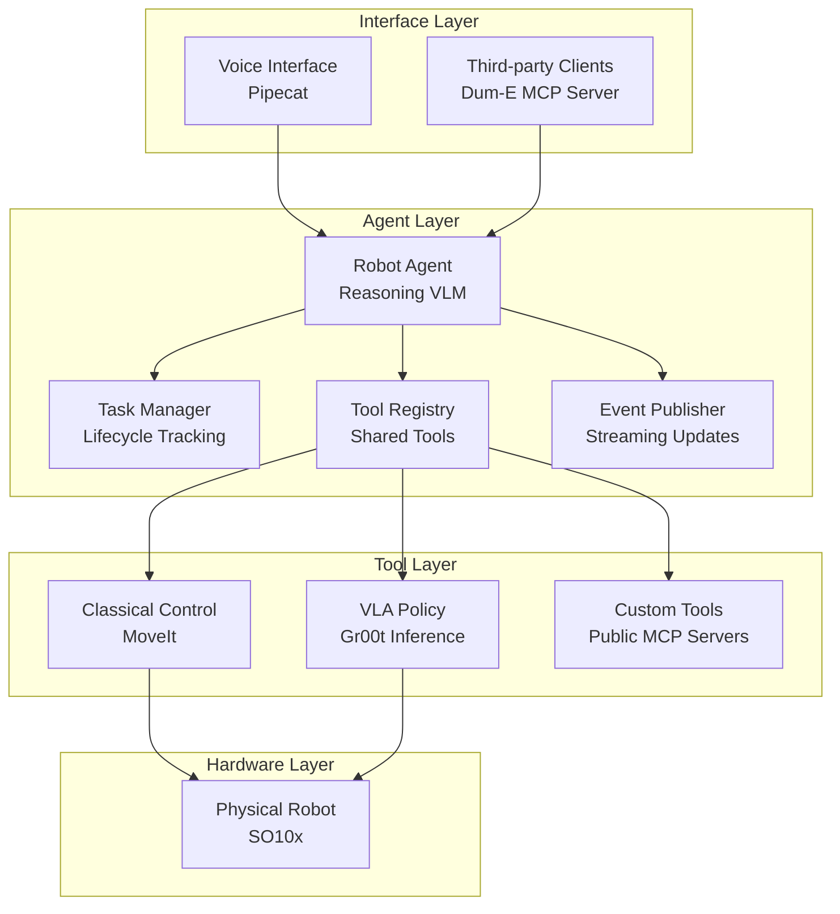

# 🦾 Dum-E | The Embodied AI Agent

<div align="center">

[](https://opensource.org/licenses/MIT)
[](https://discord.gg/g52WMMMQyT)
[](https://twitter.com/aaronsu1106)
[](https://deepwiki.com/aaronsu11/Dum-E)

*What if your favorite AI agents have hands?*

[🚀 Get Started](#-get-started) • [📖 Documentation](https://deepwiki.com/aaronsu11/Dum-E) • [🗺️ Roadmap](#%EF%B8%8F-roadmap) • [🤝 Contributing](#-contributing)

</div>

---

## 🎯 Mission

Inspired by Tony Stark's robotic assistant [Dum-E](https://marvelcinematicuniverse.fandom.com/wiki/Dum-E_and_U), the mission of this project is to create an intelligent, voice & vision enabled AI agent with robotic arm(s) capable of real-time human interaction, physical operations, and orchestration of a wide range of tools and services.

### ✨ Key Features

- 🎤 **Real-time Voice Interface** - Natural voice conversation with configurable voice and language support
- 🧠 **Long-horizon Tasks Planning** - Orchestrated by state-of-the-art VLMs with multi-modal reasoning and tool use
- 📡 **Asynchronous Tasks Execution** - Support for asynchronous task execution with streaming updates
- 👁️ **Hybrid Robot Control** - deep learning policies for generalized physical operations combined with classical control for precise manipulation
- 🔧 **Modular Architecture** - Flexible interfaces to add your own custom embodiments and tools
- 🌐 **MCP Protocol Support** - Agents and tools available via MCP for custom client integration (coming soon)

## 📺 Demo

>As part of the [LeRobot Worldwide Hackathon](https://huggingface.co/LeRobot-worldwide-hackathon) for grabbing fries.

<div align="center">

<video src="https://huggingface.co/datasets/LeRobot-worldwide-hackathon/submissions/resolve/main/191-Dum-E.mp4" controls></video>

</div>

## 🚀 Get Started

### ⚙️ Recommended System Requirements

#### Hardware
- **Robot**: SO100/101 robotic arm assembled with a wrist camera
- **Webcam**: External 1080p USB webcam for flexible vision input
- **GPU**: RTX 3060 (12GB VRAM) or better for local policy inference

#### Software
- **OS**: Linux (Ubuntu 22.04+) or Windows with WSL2
- **Python**: 3.10

### 🔧 Installation

#### 📦 Prerequisites

1. Install required system dependencies

    ```bash
    sudo apt-get update
    sudo apt-get install ffmpeg libsm6 libxext6
    ```

2. Install CUDA toolkit 12.4

    ```bash
    wget https://developer.download.nvidia.com/compute/cuda/repos/ubuntu2204/x86_64/cuda-keyring_1.1-1_all.deb
    sudo dpkg -i cuda-keyring_1.1-1_all.deb
    sudo apt-get update
    sudo apt-get -y install cuda-toolkit-12-4
    ```

3. Create a new [conda](https://www.anaconda.com/docs/getting-started/miniconda/install) or venv environment using Python 3.10, for example:

    ```bash
    conda create -n dum-e python=3.10
    conda activate dum-e
    ```

4. Download LeRobot and Isaac-GR00T source code:

    ```bash
    git clone https://github.com/huggingface/lerobot.git
    git clone https://github.com/NVIDIA/Isaac-GR00T
    ```

5. Make sure you are in the conda / venv environment and install LeRobot:

    ```bash
    # conda activate dum-e
    cd lerobot
    # use the stable version up to 5th June 2025 before hardware API redesign
    git checkout b536f47e3ff8c3b340fc5efa52f0ece0a7212a57
    # install with the feetech extension (for SO-ARM10x)
    pip install -e ".[feetech]"
    ```
    Calibrate the robot following the instructions for [SO-100](https://github.com/huggingface/lerobot/blob/b536f47e3ff8c3b340fc5efa52f0ece0a7212a57/examples/10_use_so100.md) or [SO-101](https://github.com/huggingface/lerobot/blob/b536f47e3ff8c3b340fc5efa52f0ece0a7212a57/examples/12_use_so101.md). If you already calibrated the robot before, you can simply copy and paste the `.cache` folder that includes `main_follower.json` to the root of the Dum-E repository later.

6. Install Isaac-GR00T:

    ```bash
    # conda activate dum-e
    cd ../Isaac-GR00T
    pip install --upgrade setuptools
    pip install -e .[base]
    pip install --no-build-isolation flash-attn==2.7.1.post4
    ```
    Download a fine-tuned GR00T model from Hugging Face for the task you want to perform. For example, to pick up an orange lego block as shown in our demo, you can download our checkpoint by running:
    ```bash
    huggingface-cli download aaronsu11/GR00T-N1.5-3B-FT-PICK-0613 --local-dir ./GR00T-N1.5-3B-FT-PICK --exclude "optimizer.pt"
    ```

#### 🦾 Dum-E

1. **Clone the Repository**

    ```bash
    git clone https://github.com/aaronsu11/Dum-E.git
    cd Dum-E
    ```

2. **Install Dum-E Dependencies**
    
    ```bash
    # conda activate dum-e
    pip install -r requirements.txt
    ```

3. **Start policy server**
    
    In a new terminal, run the following command to start a local policy server from the Isaac-GR00T repository:
    ```bash
    cd <path-to-Isaac-GR00T>
    python scripts/inference_service.py \
    --server \
    --model_path ./GR00T-N1.5-3B-FT-PICK \
    --embodiment_tag new_embodiment \
    --data_config so100_dualcam
    ```
    This needs to be running in the background as long as you are using the policy for inference.

4. **Test policy execution**
    
    Back in the Dum-E terminal/repository, run the following command by replacing the `<wrist_cam_idx>` and `<front_cam_idx>` with your own actual camera indices:
    ```bash
    python -m embodiment.so_arm10x.client \
    --use_policy \
    --host 0.0.0.0 \
    --port 5555 \
    --wrist_cam_idx <wrist_cam_idx> \
    --front_cam_idx <front_cam_idx> \
    --lang_instruction "Pick up the lego block."
    ```

5. **Environment Configuration**

    Sign up for free accounts at [ElevenLabs](https://elevenlabs.io/), [Deepgram](https://deepgram.com/), [Anthropic](https://www.anthropic.com/api) and obtain the API keys. Then copy the environment template and update the `.env` file with your credentials:
    ```bash
    cp .env.example .env
    ```
    Edit `.env` with your credentials:
    - Anthropic API key for LLM
    - ElevenLabs API key for TTS  
    - Deepgram API key for STT

6. **Test the robot agent**

    Once the policy is working, you can test the robot agent with text instructions by running the following command:
    ```bash
    python -m embodiment.so_arm10x.agent
    ```

7. **Start Dum-E**

    Finally, let's start Dum-E!
    ```bash
    python dum_e.py
    ```
    This will launch a web interface at `http://localhost:7860` where you can connect and speak to Dum-E using your microphone. Have fun!

## 🏗️ Architecture Overview

### Core Components



### 🔄 Data Flow

1. **Voice Interaction** → Voice / Vision Streams → Pipecat → Conversation and Task Delegation
2. **Task Planning** → Task Manager → Reasoning VLM → Multi-step Instruction Breakdown  
3. **Task Execution** → Tool Registry → Hardware Interface → SO100Robot
4. **Robot Control** → Camera Images → DL Policy / Classical Control → Joint Commands
5. **Feedback Loop** → Progress Events → Model Context → Voice Updates

## 🗺️ Roadmap

### Q3 2025
- [ ] **Voice Interaction**
  - [ ] Multi-language support (Mandarin, Japanese, Spanish etc.)
  - [ ] Emotional understanding with speech-to-speech models

- [ ] **MCP Servers**
  - [ ] Access to robot agent via MCP
  - [ ] Configurable MCP server endpoints for Dum-E

- [ ] **Local Model Support**
  - [ ] Integration with Ollama for local language model inference

- [ ] **Upgrade Dependency**
  - [ ] LeRobot new hardware APIs

### Q4 2025

- [ ] **Cross-Platform Support**
  - [ ] Docker containers for platform-agnostic deployment

- [ ] **ROS2 Integration**
  - [ ] Native ROS2 node implementation
  - [ ] Integration with existing ROS toolkits

### 🔬 Ongoing: Research Initiatives
- [ ] **Embodied AI Research**
  - [ ] Generalizable & scalable policies for physical tasks
  - [ ] Efficient dataset collection and training

- [ ] **Human-Robot Interaction**
  - [ ] Natural multi-modal understanding
  - [ ] Contextual conversation memory
  - [ ] Self-evolving personality and skillset

## 🤝 Contributing

We welcome contributions from the robotics and AI community! Here's how you can help:

### 🌟 Ways to Contribute

- **🐛 Bug Reports**: Found an issue? Create a detailed bug report
- **💡 Feature Requests**: Have ideas? Share them in our discussions or Discord
- **📝 Documentation**: Help improve our docs and tutorials
- **🧪 Testing**: Add test cases and improve coverage
- **🚀 Code**: Submit pull requests with new features or fixes

### 📋 Development Guidelines

1. **Fork the Repository**
   ```bash
   git fork https://github.com/aaronsu11/Dum-E.git
   cd Dum-E
   git checkout -b feature/issue-<number>/<your-feature-name>
   ```

2. **Follow Code Standards**
   - Use Python 3.10 type hints
   - Follow PEP 8 style guidelines
   - Add comprehensive docstrings
   - Maintain test coverage >95%

3. **Testing Requirements**
   ```bash
   # Run tests before submitting
   python -m pytest tests/
   python -m black <your-file-or-directory>
   python -m isort <your-file-or-directory>
   ```

4. **Pull Request Process**
   - Create detailed PR description
   - Link related issues
   - Ensure CI/CD passes
   - Request review from maintainers

### 👥 Community

- **Discord**: [Join our community](https://discord.gg/g52WMMMQyT)
- **GitHub Discussions**: Share ideas and get help

## 📄 License

This project is licensed under the MIT License - see the [LICENSE](LICENSE) file for details.

This project builds on top of the following open-source projects:

- [Pipecat Framework](https://github.com/pipecat-ai/pipecat/blob/main/LICENSE)
- [Strands Agents](https://github.com/strands-agents/sdk-python/blob/main/LICENSE)
- [Isaac GR00T](https://github.com/NVIDIA/Isaac-GR00T/blob/main/LICENSE)
- [LeRobot](https://github.com/huggingface/lerobot/blob/main/LICENSE)

---

<div align="center">

**⭐ Star us on GitHub — it motivates us a lot!**

[🚀 Get Started](#-get-started) • [📖 Documentation](https://deepwiki.com/aaronsu11/Dum-E) • [🤝 Join Community](https://discord.gg/g52WMMMQyT) • [💼 Commercial Use](mailto:aaronsu11@outlook.com)

*Built with ❤️ for the future of robotics*

</div> 