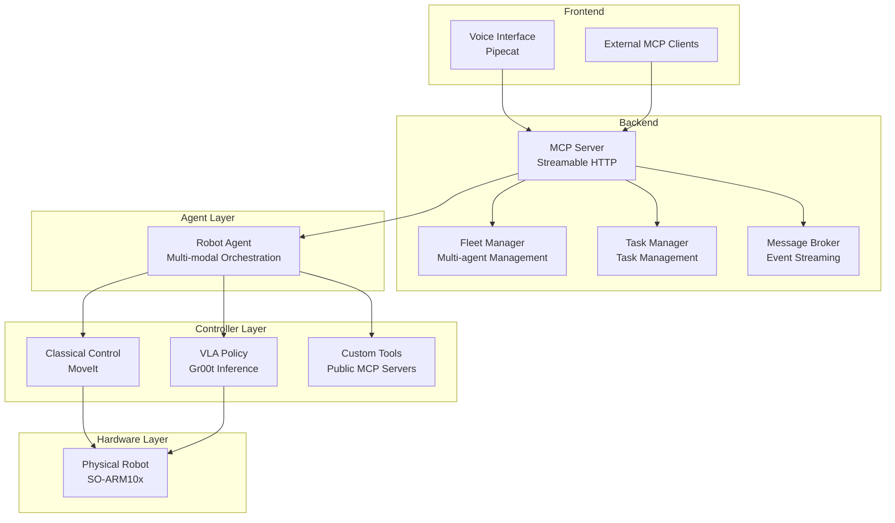

# 🦾 Dum-E | The Embodied AI Agent

<div align="center">

[](https://opensource.org/licenses/MIT)
[](https://discord.gg/g52WMMMQyT)
[](https://twitter.com/aaronsu1106)
[](https://deepwiki.com/aaronsu11/Dum-E)

*What if your favorite AI agents have hands?*

[🚀 Get Started](#-get-started) • [📖 Documentation](https://deepwiki.com/aaronsu11/Dum-E) • [🗺️ Roadmap](#%EF%B8%8F-roadmap) • [🤝 Contributing](#-contributing)

</div>

---

## 🎯 Mission

Inspired by Tony Stark's robotic assistant [Dum-E](https://marvelcinematicuniverse.fandom.com/wiki/Dum-E_and_U), the mission of this project is to create an intelligent, voice & vision enabled AI agent with robotic arm(s) capable of real-time human interaction, physical operations, and orchestration of a wide range of tools and services.

### ✨ Key Features

- 🎤 **Real-time Voice Interface** - Natural voice conversation with configurable voice and multi-language support
- 🧠 **Long-horizon Tasks Planning** - Orchestrated by state-of-the-art VLMs with multi-modal reasoning and tool use
- 📡 **Asynchronous Tasks Execution** - Support for asynchronous task execution with streaming updates
- 👁️ **Hybrid Robot Control** - Deep learning policies for generalizable physical operations combined with classical control for precise manipulation
- 🔧 **Modular Architecture** - Flexible interfaces to add your own custom backends, embodiments and tools
- 🌐 **MCP Support** - Agents and tools available via MCP for custom client integration

## 📺 Demo

> 🔊 Watch with sound to hear voice interactions

<div align="center">

<video src="https://github.com/user-attachments/assets/035d252a-e437-484f-a502-9f95a5bceb6f" controls></video>

</div>

## 🚀 Get Started

This project supports two deployment patterns:

1. **Single Workstation**: Run everything locally on a single machine with GPU
2. **Client-Server**: Run policy server on a separate GPU server while keeping lightweight client components local, useful when your local machine doesn't meet the GPU requirements

Choose the setup that best matches your needs and hardware availability. The following sections will guide you through the installation process.

### ⚙️ System Requirements 

#### Common

- **Robot**: SO100/101 robotic arm assembled with wrist camera
- **Webcam**: 640p+ USB webcam for additional vision input

#### For Single Workstation

- **GPU**: NVIDIA Ampere or later with at least 12GB VRAM (tested on RTX 3060) and driver ≥ 535.0
- **OS**: Ubuntu 22.04/24.04 LTS or Windows with WSL2

#### For Client-Server

- **Server**: Any machine with 12GB+ VRAM NVIDIA GPU, e.g. EC2 g4dn/g5/g6
- **Client**: Any machine with 4GB+ RAM
- **OS**: Any OS (MacOS/Windows/Linux)

### 🔧 Installation

#### 📦 On Single Workstation or Server
> Requires 1) NVIDIA GPU 2) Linux or WSL2

1. Install required system dependencies

    ```bash
    sudo apt-get update
    sudo apt-get install ffmpeg libsm6 libxext6
    ```

2. Install CUDA toolkit 12.4

    ```bash
    wget https://developer.download.nvidia.com/compute/cuda/repos/ubuntu2204/x86_64/cuda-keyring_1.1-1_all.deb
    sudo dpkg -i cuda-keyring_1.1-1_all.deb
    sudo apt-get update
    sudo apt-get -y install cuda-toolkit-12-4
    ```

3. Create a [conda](https://www.anaconda.com/docs/getting-started/miniconda/install) or venv environment using Python 3.10 for gr00t policy server:

    ```bash
    conda create -y -n gr00t python=3.10
    conda activate gr00t
    ```

4. Clone Isaac-GR00T repository:

    ```bash
    git clone https://github.com/NVIDIA/Isaac-GR00T
    ```

5. Install Isaac-GR00T:

    ```bash
    cd Isaac-GR00T
    # use the tested version on 12th Sep 2025
    git checkout b211007ed6698e6642d2fd7679dabab1d97e9e6c

    # conda activate gr00t
    pip install --upgrade setuptools
    pip install -e .[base]
    pip install --no-build-isolation flash-attn==2.7.1.post4
    ```
    Download a fine-tuned GR00T model from Hugging Face for the task you want to perform. For example, to pick up a fruit (apple, banana, orange, etc.) and put it on the plate, you can download our checkpoint by running:
    ```bash
    hf download aaronsu11/GR00T-N1.5-3B-FT-FRUIT-0810 --local-dir ./GR00T-N1.5-3B-FT --exclude "optimizer.pt"
    ```

6. Start policy server
    
    Run the following command to start the gr00t policy server:
    ```bash
    python scripts/inference_service.py \
    --server \
    --model_path ./GR00T-N1.5-3B-FT \
    --embodiment_tag new_embodiment \
    --data_config so100_dualcam
    ```
    This needs to be running as long as you are using the gr00t policy for inference. Note down the IP address of the policy server (`<policy_host>`) and make sure port 5555 is accessible from the client.

#### On Single Workstation or Client

1. Clone the Repository

    ```bash
    git clone https://github.com/aaronsu11/Dum-E.git
    ```

2. Create a [conda](https://www.anaconda.com/docs/getting-started/miniconda/install) or venv environment using Python 3.12 for dum-e client:
    ```bash
    conda create -y -n dum-e python=3.12
    conda activate dum-e
    ```

3. Install Dum-E Dependencies
    
    ```bash
    cd Dum-E
    # conda activate dum-e
    pip install -r requirements.txt
    ```

> [!NOTE]
> If you have never set up SO-ARM before:
> - Find the `wrist_cam_idx` and `front_cam_idx` by running `lerobot-find-cameras`
> - Find the `robot_port` of by running `lerobot-find-port`
> - Calibrate the robot following the instructions for [SO-100](https://huggingface.co/docs/lerobot/en/so100#calibrate) or [SO-101](https://huggingface.co/docs/lerobot/en/so101#calibrate) and note down your `robot_id`. For example with SO-101, run: `lerobot-calibrate --robot.type=so101_follower --robot.port=<robot_port> --robot.id=<robot_id>`
    

4. Configure Dum-E

    ```bash
    cp config.example.yaml my-dum-e.yaml
    ```
    Edit my-dum-e.yaml:
    - Set `controller.robot_type`/`robot_port`/`robot_id`/`wrist_cam_idx`/`front_cam_idx`
    - Set `controller.policy_host` to your gr00t policy server IP (or `localhost`)
    - Optionally set `agent.profile` and `voice.mode`/`profile` to use different model presets


5. Test policy execution

    ```bash
    # Uses controller.* from YAML
    python -m embodiment.so_arm10x.controller --config my-dum-e.yaml --instruction "<your-instruction>"
    ```

> [!NOTE]
> If the robot is not moving, check if the gr00t policy server is running and the port is accessible from the client by running 
> * `nc -zv <policy_host> 5555` (on MacOS/Linux) or 
> * `Test-NetConnection -ComputerName <policy_host> -Port 5555` (on Windows PowerShell).

6. Environment configuration for agent and voice

    > Sign up for free accounts at [ElevenLabs](https://elevenlabs.io/), [Deepgram](https://deepgram.com/), [Anthropic](https://www.anthropic.com/api) and obtain the API keys if you are using the default profile, or get your AWS credentials if you are using the `aws` profile.
    
    Copy the environment template and update the `.env` file with your credentials:
    ```bash
    cp .env.example .env
    ```
    Edit `.env` with your credentials (choose one of the following):
    - For `default` profile:
        - Anthropic API key for LLM
        - ElevenLabs API key for TTS  
        - Deepgram API key for STT
    - For `aws` profile:
        - AWS Access Key ID
        - AWS Secret Access Key
        - AWS Region

> [!NOTE]
> You can optionally configure [Langfuse](https://langfuse.com/) observability for agent and voice by setting `LANGFUSE_PUBLIC_KEY`, `LANGFUSE_SECRET_KEY` and `LANGFUSE_HOST` in the `.env` file.

7. Test the robot agent

    ```bash
    # One-shot instruction (agent inherits controller.* unless overridden in agent section)
    python -m embodiment.so_arm10x.agent --config my-dum-e.yaml --instruction "<your-instruction>"
    ```

8. Start Dum-E

    Finally, start the full stack with the voice interface, MCP server and robot agent:
    ```bash
    python dum_e.py --config my-dum-e.yaml
    ```
    This will launch the voice interface at `http://localhost:7860` where you can connect and speak to Dum-E using your microphone. Have fun!

    > You can also start only the voice interface and MCP servers. Useful for testing the servers independently without the robot hardware:
    > ```bash
    > python dum_e.py --node servers --config my-dum-e.yaml
    > ```

## 🏗️ Architecture Overview

### Core Components



### 🔄 Data Flow

1. **Voice Interaction**: Voice Streams → Cascaded / Speech-to-Speech Processor → Conversation and Task Delegation
2. **Task Execution**: Task Manager → Robot Agent → VLM Reasoning → Robot Controller Tools → Robot Hardware
3. **Robot Control**: Task Instruction + Camera Images → DL Policy / Classical Control → Joint Commands
4. **Streaming Feedback**: Agent Streaming Responses → Message Broker → MCP Context → Voice Updates

## 🗺️ Roadmap

### Q3 2025
- [x] **Voice Interaction**
  - [x] Multi-language support (Mandarin, Japanese, Spanish etc.)
  - [x] Emotional understanding with speech-to-speech models

- [x] **MCP Servers**
  - [x] Access to robot agent via MCP
  - [x] Configurable MCP server endpoints for Dum-E

- [ ] **Local Model Support**
  - [ ] Integration with Ollama for local language model inference

- [x] **Upgrade Dependency**
  - [x] LeRobot new hardware APIs

### Q4 2025

- [ ] **Cross-Platform Support**
  - [ ] Docker containers for platform-agnostic deployment

- [ ] **ROS2 Integration**
  - [ ] Native ROS2 node implementation
  - [ ] Integration with existing ROS toolkits

### 🔬 Ongoing: Research Initiatives
- [ ] **Embodied AI Research**
  - [ ] Generalizable & scalable policies for physical tasks
  - [ ] Efficient dataset collection and training

- [ ] **Human-Robot Interaction**
  - [ ] Natural multi-modal understanding
  - [ ] Contextual conversation memory
  - [ ] Self-evolving personality and skillset

## 🤝 Contributing

We welcome contributions from the robotics and AI community! Here's how you can help:

### 🌟 Ways to Contribute

- **🐛 Bug Reports**: Found an issue? Create a detailed bug report
- **💡 Feature Requests**: Have ideas? Share them in our discussions or Discord
- **📝 Documentation**: Help improve our docs and tutorials
- **🧪 Testing**: Add test cases and improve coverage
- **🚀 Code**: Submit pull requests with new features or fixes

### 📋 Development Guidelines

1. **Fork the Repository**
   ```bash
   git fork https://github.com/aaronsu11/Dum-E.git
   cd Dum-E
   git checkout -b feature/issue-<number>/<your-feature-name>
   ```

2. **Follow Code Standards**
   - Use Python 3.12 type hints
   - Follow PEP 8 style guidelines
   - Add comprehensive docstrings
   - Maintain test coverage > 50%

3. **Testing Requirements**
   ```bash
   # Run tests before submitting
   python -m pytest tests/
   python -m black <your-file-or-directory>
   python -m isort <your-file-or-directory>
   ```

4. **Pull Request Process**
   - Create detailed PR description
   - Link related issues
   - Ensure CI/CD passes
   - Request review from maintainers

### 👥 Community

- **Discord**: [Join our community](https://discord.gg/g52WMMMQyT)
- **GitHub Discussions**: Share ideas and get help

## 📄 License

This project is licensed under the MIT License - see the [LICENSE](LICENSE) file for details.

This project builds on top of the following open-source projects:

- [Pipecat Framework](https://github.com/pipecat-ai/pipecat/blob/main/LICENSE)
- [FastMCP](https://github.com/jlowin/fastmcp/blob/main/LICENSE)
- [Strands Agents](https://github.com/strands-agents/sdk-python/blob/main/LICENSE)
- [Isaac GR00T](https://github.com/NVIDIA/Isaac-GR00T/blob/main/LICENSE)
- [LeRobot](https://github.com/huggingface/lerobot/blob/main/LICENSE)

---

<div align="center">

**⭐ Star us on GitHub — it motivates us a lot!**

[🚀 Get Started](#-get-started) • [📖 Documentation](https://deepwiki.com/aaronsu11/Dum-E) • [🤝 Join Community](https://discord.gg/g52WMMMQyT) • [💼 Commercial Use](mailto:aaronsu11@outlook.com)

*Built with ❤️ for the future of robotics*

</div> 