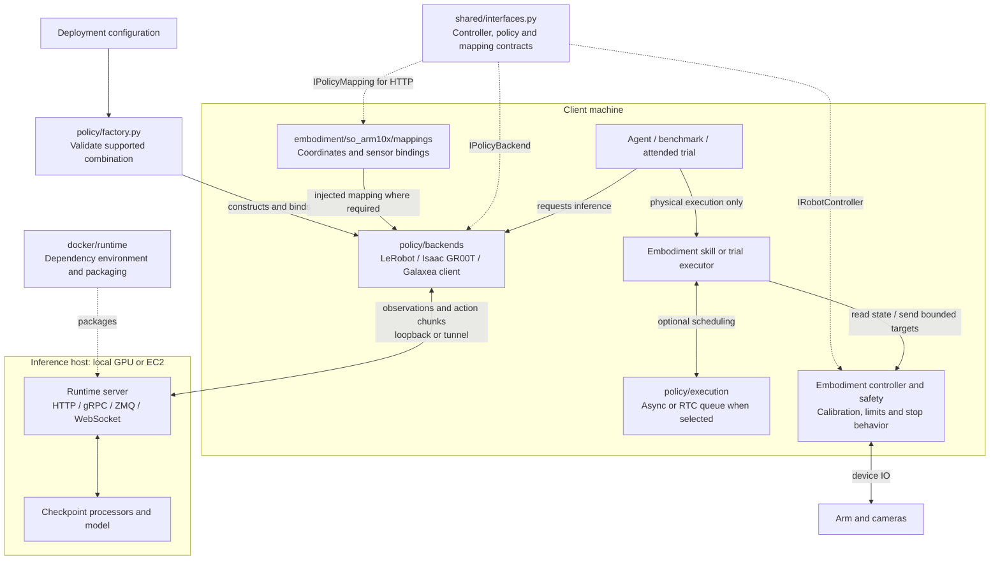
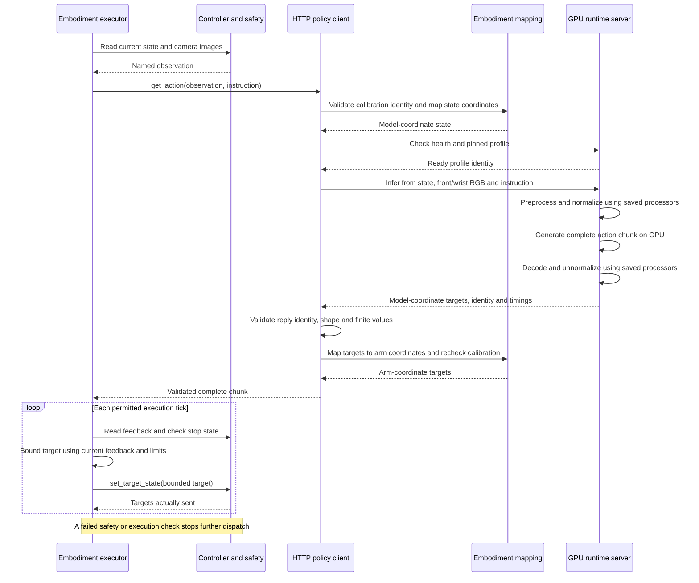

# Embodiments, policies and execution

Dum-E composes an embodiment with a policy through `shared.IRobotController`, `shared.IPolicyBackend` and `shared.IPolicyMapping`. Runtime, transport, model family, checkpoint and execution mode are separate choices. `policy/factory.py` is the composition point used by the agent, benchmark and physical trial tools. It validates combinations before constructing a client; it never substitutes a different model.

## Ownership

The arrows below show composition and runtime communication. The factory supplies the embodiment mapping to the client; runtime packages do not import the concrete embodiment.



| Location | Owns | Must not own |
|---|---|---|
| `shared/interfaces.py`, `shared/types.py` | Public interfaces, task and fleet data | Concrete robot or model implementations |
| `embodiment/so_arm10x/` | Hardware IO, calibration, limits, skills, stop behavior, attended trials | Model loading, inference server processes |
| `embodiment/so_arm10x/mappings/` | Joint order, sensor bindings, coordinate transforms | Checkpoint normalization or motor writes |
| `policy/backends/lerobot/` | LeRobot clients, HTTP/gRPC serving and processors | Hardware access or an imported concrete embodiment |
| `policy/backends/isaac_groot/` | Native ZMQ client/server, pinned backbone cache | Hardware access |
| `policy/backends/galaxea/` | Native WebSocket exchange, codec and G05 serving | Hardware access |
| `policy/execution/` | Async queue, RTC prefix queue and deadlines | Calibration, SDK calls or robot-specific projection |
| `policy/checkpoints.py` | Pinned LeRobot checkpoint profiles | Robot configuration |
| `policy/telemetry.py`, `policy/evidence.py` | Chunk timing and bounded evidence IO | Physical approval or hardware identity |
| `configs/deployments/` | Validated composition examples | Secrets, machine addresses or calibration files |
| `docker/<runtime>/` | Dependency environments and packaging | Python server implementations |
| `scripts/` | CLI entry points and application orchestration | Duplicated model adapters or safety implementations |
| `tests/{policy,embodiment,integration}/` | Tests mirroring those boundaries | Physical trials in the default suite |

LeRobot's `models/` contains the GR00T contract/loader, Pi0.5 loader and pinned SO101 processor manifest, and MolmoAct2 loader. Its `runtime.py` owns request serialization, inference and health reporting. `server.py`/`preflight.py` serve GR00T over gRPC; `http_server.py` serves recorded-observation and bounded-trial requests. Different protocols share model loading rather than copying it into Docker wrappers.

`HTTPPolicyBackend` receives an `IPolicyMapping`; it does not import SO101. The SO101 implementation checks calibration identity, converts centered degrees into checkpoint coordinates where required, and reverses the transform on returned chunks. MolmoAct2 and HTTP GR00T need no separate client subclass. Pi0.5 has an additional client for its explicit RTC prefix protocol. The Galaxea client receives its grouped observation/action mapping from the factory. Native GR00T and LeRobot gRPC retain their existing named-feature interfaces and normalized-state conventions.

The current HTTP wire schema remains six state values and front/wrist RGB images. Injecting a mapping does **not** qualify arbitrary dimensions or another embodiment. A different schema must be explicit at both ends. Model normalization runs once in the saved processor; physical calibration and safety projection stay with the embodiment.

## Observation-to-action interaction

This sequence follows one synchronous HTTP chunk after preparation and approval. Galaxea uses its grouped native mapping, while native GR00T and LeRobot gRPC retain their named-feature conventions. A recorded benchmark substitutes a recording for controller observations and never dispatches targets.



Async execution overlaps inference with playback of previously queued targets. See [async and RTC interactions](ASYNC-INFERENCE.md#execution-interactions) for the two supported scheduling paths.

## Configuration

```yaml
embodiment: so_arm10x
backend: lerobot
policy: pi05
checkpoint: pi05-so101
transport: http
execution: rtc
```

`checkpoint` identifies a pinned profile, not an arbitrary Hub name. The factory rejects unknown embodiments/checkpoints and unsupported execution modes. Machine-specific robot ports, camera indices, calibration and server port remain separately supplied. Existing `DUME_POLICY_BACKEND` configuration remains supported for the agent; the bounded tools accept `--deployment` in place of `--profile`:

```bash
.venv/bin/python scripts/benchmark_policy.py \
  --deployment configs/deployments/so101_pi05.yaml \
  --observations /path/to/observation.npz --instruction 'Pick the banana' \
  --port 8081 --output outputs/pi05-benchmark

.venv/bin/python scripts/run_policy_trial.py prepare \
  --deployment configs/deployments/so101_pi05_rtc.yaml \
  --config /path/to/robot.yaml --warmup-observation /path/to/observation.npz \
  --workspace outputs/pi05-rtc-trial --port 8081
```

Use the same arguments for `approve` and `run`, adding the present operator's name for approval. See [validation](POLICY-VALIDATION.md). Selecting RTC constructs a client with the prefix API; the bounded trial executor supplies scheduling. It does not enable RTC in the voice agent. GR00T's production async skill and Pi0.5's bounded RTC executor remain distinct qualified workflows. A chunk-latency benchmark does not claim to measure RTC scheduling.

## Naming and extension rules

Use `snake_case` for Python modules and deployment filenames. Use runtime names for backend and Docker directories; put model-specific loading in `models/<family>.py`. A second LeRobot dependency recipe is `docker/lerobot/Dockerfile.multi_policy`, not a separate runtime named after an experiment. The Isaac GR00T build script intentionally uses the pinned upstream Docker recipe; there is no empty local Docker directory.

Add a file only when it owns a distinct responsibility. Do not add empty placeholders for future robots, a client subclass for a different checkpoint alone, or phase/lab/guard packages that accumulate unrelated code. Keep synchronous hardware dispatch in the embodiment's existing skill/trial loop; a generic synchronous scheduler is unnecessary until there is shared behavior to extract.

For a new embodiment, implement hardware IO, an explicit mapping and its safety/execution contract, then register supported deployments in the factory. Reuse the existing runtime if the checkpoint/protocol supports that embodiment. Follow [the extension guide](EXTENDING-EMBODIMENTS.md); Galaxea R1 Pro is a future target, not implemented support.

## Migration and validation

`policy_guard` and `policy_lab` have been removed. Their model contracts, telemetry, evidence, scheduling, hardware validation and server code now live with their owners. Old internal module imports must be updated; the serving and physical-trial script commands remain available. Tests protect the rule that runtime and scheduler packages cannot import concrete embodiments, and demonstrate mapping injection with different joint names.

Physical approvals and async admission records include source hashes. The moved implementation paths intentionally invalidate older approvals/admission files; regenerate them from the current checkout. Historical physical evidence remains historical and is not relabeled as post-refactor validation.
