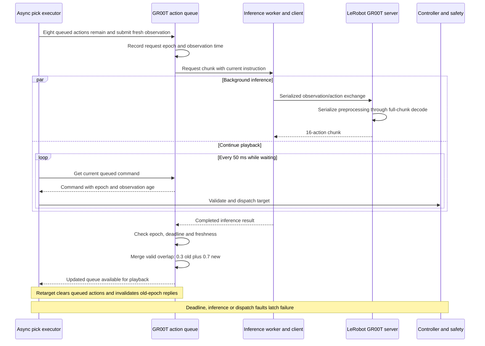
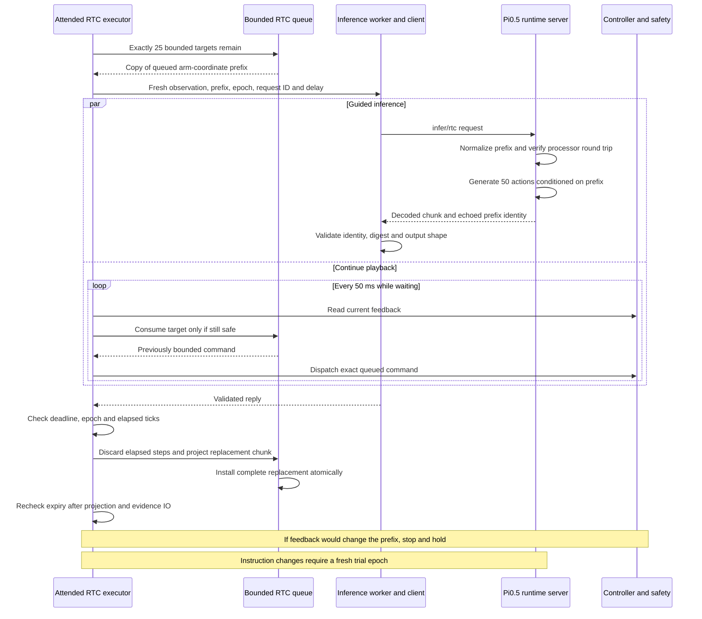

# Async inference

These are two different implementations, not one interchangeable async switch.

| | GR00T LeRobot queue | Pi0.5 bounded RTC |
|---|---|---|
| Entry point | Production agent with `DUME_ASYNC_INFERENCE=1` | `run_policy_trial.py --profile pi05-so101 --scheduler rtc` |
| Chunk / playback | 16 actions / 20 Hz | 50 actions / 20 Hz |
| Replacement request | Eight actions remain | 25 bounded queued actions remain |
| Continuity | 0.3 old / 0.7 new weighted overlap | Model conditions on the actually queued prefix in normalized action space |
| Deadline | Measured request p99 + 100 ms; validated against overlap | 750 ms bounded trial deadline; 15-step inference delay |
| Task change | Epoch invalidation and stale-reply refusal | No implicit retargeting in the attended trial |

Pi0.5's normal agent adapter rejects `DUME_ASYNC_INFERENCE`; use its RTC runner. Native GR00T, G0.5 and Molmo do not inherit the LeRobot queue just because they return chunks.

GR00T keeps one inference worker and one serial owner. The server serializes preprocessing through full-chunk decode to preserve the observation anchor; the client serializes exchanges. Inference and robot calls run off the agent event loop. A miss, stale action, inference error or clamp latches failure, closes the policy connection and prevents subsequent motion/reset. Cancellation and retarget propagate through the task/MCP/voice paths. A transmitted motor packet cannot be recalled.

The normal worker reuses a successful policy session; `prepare_execution` performs warmup before applying the measured request deadline. A failure requires explicit recovery, not automatic stop-latch clearing.

## Execution interactions

These diagrams start after warmup and installation of the first chunk. The embodiment executor owns hardware dispatch throughout; inference workers only return policy results.

### GR00T: prefetch and merge overlapping chunks



### Pi0.5 RTC: condition inference on the bounded prefix

The prefix contains commands already bounded for this arm. It is guidance to the model, not just a client-side blend. The server converts it to normalized action space and verifies the saved processor round trip.



## GR00T admission measurement

The existing loader requires at least 100 finite sequential RPC samples, the empirical higher-order p99 and matching source hashes. This larger sample is only needed for this existing async admission contract; ordinary model smoke remains 12 samples.

```bash
uv run python scripts/benchmark_policy.py --profile lerobot-gr00t \
  --observations outputs/capture-01/observation.npz \
  --calibration /absolute/path/calibration.json --instruction 'Pick up the banana' \
  --samples 100 --warmups 1 --latency-settings --server-container dume-lerobot --output outputs/gr00t-latency-01
```

Use the lightweight CUDA server built from the same sources. Re-measure after source or serving configuration changes. Set `DUME_ASYNC_LATENCY_PATH` to the resulting `latency.json` and explicitly select `DUME_POLICY_BACKEND=lerobot` with `DUME_ASYNC_INFERENCE=1`. The earlier measured operating point was median 143.818 ms, empirical p99 150.098 ms and deadline 250.098 ms within 400 ms overlap. It is not a tail-latency guarantee.

## Pi0.5 RTC invariant

The queued prefix must equal the bounded commands the controller will receive. The server maps that prefix through the saved processor into normalized action space; degrees cannot be passed as normalized guidance. It uses `torch.no_grad()` so the RTC implementation can enable gradients locally; `torch.inference_mode()` is incompatible with that guidance. Reply identity, epoch, prefix digest and elapsed steps are checked. Expiration is checked again after projection/evidence work, before dispatch. If current feedback invalidates the queued prefix, stop rather than silently changing guidance.

Three recorded local comparisons measured ordinary generation 414.22 ms versus RTC 422.43 ms, about 2% overhead. Supporting dummy playback peaked at 8.87 GiB. Physical trial14 played 100 targets with two nine-tick handoffs and a maximum 50.23 ms command interval; visible smooth motion and hold were confirmed. These small checks do not establish sustained or physical-fault robustness.

## Deferred startup optimization

A successful voice-triggered trial took 36.729 s from dispatch to the recorded motion-stage entry: 15.429 s process/preflight, 18.660 s policy setup/warmup/checks and 2.639 s controller/calibration setup. This timestamp was not independently measured first physical movement. Warm chunk generation averaged 163.284 ms.

Future work: prepare a persistent session once, publish readiness after warmup, and reuse it across tasks while preserving fresh observations, per-task queues/epochs and stop recovery. Measure cold readiness and warm dispatch-to-first-command separately. The software reuse test is not a measured warm hardware startup result. Session-long hardware ownership needs its own review.
